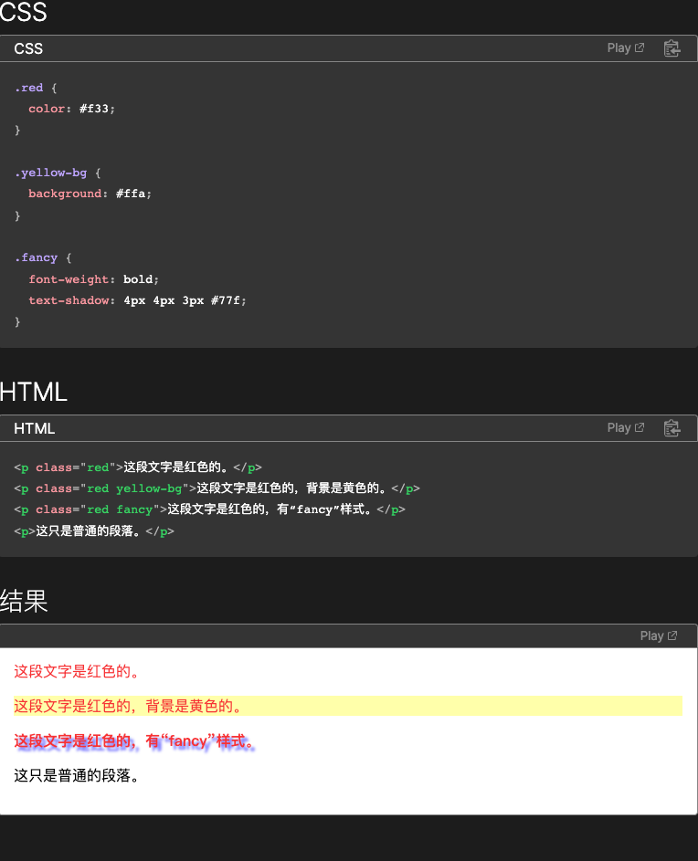

# 基本选择器

## 通用选择器

在 CSS 中，一个星号 (_) 就是一个通配选择器。它可以匹配任意类型的 HTML 元素。在配合其他简单选择器的时候，省略掉通配选择器会有同样的效果。比如，_.warning 和.warning 的效果完全相同。

## 元素选择器

CSS 类型选择器通过节点名称匹配元素。换句话说，它选择一个文件中所有给定类型的元素。

## 类选择器

CSS 类选择器根据 class 属性的内容匹配元素。

## ID 选择器

CSS ID 选择器会根据该元素的 id 属性中的内容匹配元素。为了使该元素被选中，它的 id 属性必须与选择器中给出的值完全匹配。

## 属性选择器

CSS 属性选择器匹配那些具有特定属性或属性值的元素。

# 分组选择器

## 选择器列表

CSS 选择器列表（,）选择所有匹配的节点。选择器列表是以逗号分隔的多个选择器所组成的列表

# 组合器

## 后代组合器

“ ”（空格）组合器选择前一个元素的后代节点。

## 直接子代组合器

\> 组合器选择前一个元素的直接子代的节点。

## 一般兄弟组合器

~ 组合器选择兄弟元素，也就是说，后一个节点在前一个节点后面的任意位置，并且共享同一个父节点。

## 紧邻兄弟组合器

\+ 组合器选择相邻元素，即后一个元素紧跟在前一个之后，并且共享同一个父节点。

## 列组合器

|| 组合器选择属于某个表格行的节点。

# 伪选择器

## 伪类

: 伪选择器支持按照未被包含在文档树中的状态信息来选择元素。

## 伪元素

:: 伪选择器用于表示无法用 HTML 语义表达的实体。
