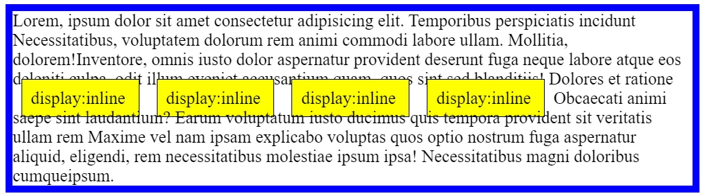
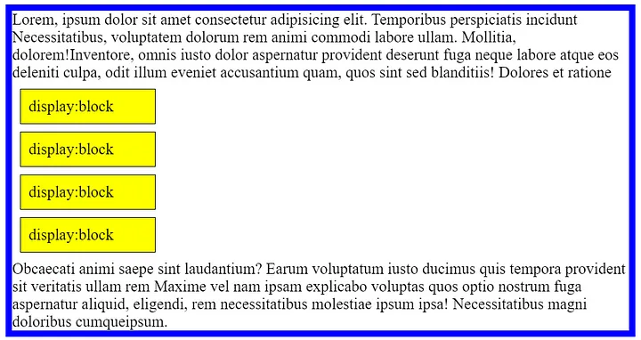
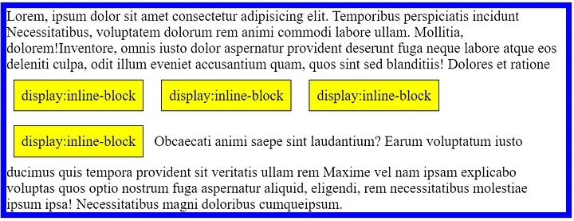

# 元素

元素是文档结构的根基。HTML 中常用的元素有 p、span、a 和 div 等。

## 置换元素和非置换元素

CSS 依赖元素，元素通常有两种形式：置换元素和非置换元素。

### 置换元素/替换元素

在 CSS 中，可替换元素的展示效果不是由 CSS 来控制的。既它们的内容不受当前文档的样式的影响。CSS 可以影响可替换元素的位置，但不会影响到可替换元素自身的内容。

典型的可替换元素有：

- \<iframe>
- \<video>
- \<embed>
- \

#### 匿名置换元素

用 CSS content 属性插入的对象是匿名的可替换元素。它们并不存在于 HTML 标记中，因此是“匿名的”。

### 非置换元素/非替换元素

HTML 的大多数元素是不可替换元素，即其内容直接表现给用户端（例如浏览器）

## 元素的显示方式

每一个 html 元素都会有一个预设的 display 属性，元素基本上大部分可分为两种显示方式，一种是行内元素（inline），另一种是区块元素（block），通过 CSS display 赋予新的属性，以改变元素的显示方式

常见的区块元素：div、ul li、p、h1
常见的行内元素：span、a、input、img

## inline、block、inline-block 的差别

### inline 行内元素

- 元素可在同一行内呈现，图片或文字均不换行，也不会影响其版面配置
- 不可设定长宽，元素的宽高由它的内容撑开

**行内元素不是不能设定 margin/padding , 是排版不会随着设定改变，字仍在行内，其他行并不会被推开。**



```css
.box_inline {
	border: 1px solid black;
	padding: 10px;
	margin: 10px;
	background-color: yellow;
	display: inline;
}
```

由上图范例 1 可以看到：

- 设定 `display:inline` 就会使得原本 div 的 block 改变成 inline 属性
- 虽有设定 padding 和 margin ，但元素上下并不会把其他行推开，但若设定边框或背景颜色就会发现事实上会使得其他行被覆盖。

### block 区块元素

- 元素宽度预设会撑到最大，使其占满整个容器
- 可以预设长宽 margin/padding ，但仍会占满一整行



```css
.box_block {
	border: 1px solid black;
	padding: 10px;
	margin: 10px;
	background-color: yellow;
	width: 150px;
	display: block;
}
```

由上例可以发现虽然可以设定宽高 padding/margin ,但其属性仍会向右占满容器，下个元素就会换行来呈现，并不会并排。

### inline-block 行内区块元素

- 以 inline 的方式呈现，但同时拥有 block 的属性
- 可设定元素的宽高 margin/padding
- 可水平排列



```css
.box_inline-block {
	border: 1px solid black;
	padding: 10px;
	margin: 10px;
	background-color: yellow;
	display: inline-block;
}
```

由上可以发现设定 `display:inline-block` 后，即可同时拥有 block 可设定宽高的属性，但其排版扔像 inline 属性，并不会向右占满整个容器。
